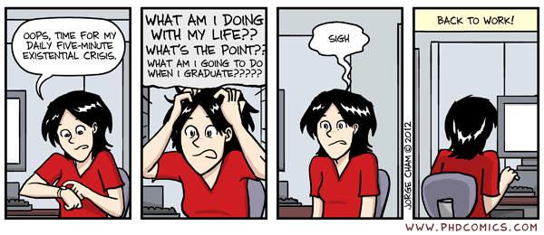

Awesome CS-Ja PhD Life
---

博士課程をサバイブするために参考になりそう/モチベになりそうな記事や資料のリスト。
日本語で読めるCS関連のものが中心です。
卒修論に役立つものも掲載しますし、その後のキャリアの話も掲載します。

## 前置き

- __趣味運営です。__ 誰かの約に立てばそれで良い。[方針](./CONTRIBUTION.md) も参照してください
- 私の/あの子のawesomeな記事が載ってない! => __プルリク等大歓迎です!__
- 私の記事はawesomeじゃない => __博士課程/博士持ちってだけで既にawesomeですよ!__

<!-- START doctoc -->
<!-- END doctoc -->

---

## 心構え 👀

- [研究をはじめる前に知っておいて欲しい7つのこと](https://speakerdeck.com/kaityo256/welcome-to-lab) [2021, [@kaityo256](https://twitter.com/kaityo256)]
- [博士の話](https://gist.github.com/kaityo256/bd73365ec4f756dc305b6f612343d27a) [2020, [@kaityo256](https://twitter.com/kaityo256)]
- [ロボット対話知能研究室へようこそ](http://pomdp.net/docs/20220427_intro_public_koichiro.slides.pdf) [2022, [@caesar_wanya](https://twitter.com/caesar_wanya/status/1518877284408602624)]
- [大学院・研究者を目指す人へ](http://www7b.biglobe.ne.jp/~masaoamano/~masaoamano/da-xue-yuan-yan-jiu-zhewo-mu-zhisu-renhe.html) [[長崎大学水産学部海棲哺乳類研究室](http://www7b.biglobe.ne.jp/~masaoamano/)]
- [コンピュータ科学の博士課程にきて初めて分かったこと4つ](https://blog.junkato.jp/ja/posts/2012-11-13-cs-phd-findings/) [2012, [@arcatdmz](https://twitter.com/arcatdmz)]
- [学際研究と壁](https://mercurial-caper-b6a.notion.site/f4d3b5d6554841869d7f67dafc6dbae5) [2021, [@resnant](https://twitter.com/resnant)]

## 研究の進め方 ☕

- [情報系研究者のためのtips 2019年度版](https://qiita.com/guicho271828/items/3664aec81f6cc7e8f179) [2019, [@guicho271828](https://twitter.com/guicho271828)]
- [研究をはじめてから国際会議と学術論文に採択されるまで](https://speakerdeck.com/kyama0321/yan-jiu-wohazimetekaraguo-ji-hui-yi-toxue-shu-lun-wen-nicai-ze-sarerumade-webgong-kai-ban) [2019, [Katsuhiko Yamamoto](https://sites.google.com/site/kyama0321/ja)]
- [試行回数の増やし方 2021年度版](https://speakerdeck.com/butsugiri/increasing-number-of-attempts-ver-2021) [2021, [Shun Kinyono](https://butsugiri.github.io/)]
- [一流論文誌・国際会議に採択されるための研究「心・技・体」](https://www.ipsj.or.jp/journal/info/hara75.pdf) [2014, [Takahiro Hara](https://mmde-lab.github.io/hara-webpage/)]
- [機械学習の研究者を目指す人へ](https://takahashihiroshi.github.io/contents/for_ml_beginners.html) [[Hiroshi Takahashi](https://takahashihiroshi.github.io/)]
- [難関国際会議の壁](https://kanojikajino.github.io/2021-12-01/wall/) [2021, [@azaazarashi](https://twitter.com/azaazarashi)]
- [先行研究被りの話](https://kanojikajino.github.io/2022-02-13/prior-work/) [2022, [@azaazarashi](https://twitter.com/azaazarashi)]
- [研究で詰まっている時におススメな本](https://snowman-88888.hatenablog.com/entry/2021/08/29/161357) [2021, [@sei_shinagawa](https://twitter.com/sei_shinagawa)]

### 研究テーマの見つけ方

🤔

### 論文の読み方 / 探し方 📖

- [論文の読み方](https://speakerdeck.com/kaityo256/how-to-survey) [2021, [@kaityo256](https://twitter.com/kaityo256)]
- [研究分野をサーベイする](https://www.slideshare.net/iTooooooooooooT/itolab-how-to-survey-2017) [2017, [@1T0T](https://twitter.com/1T0T)]
- [高速で論文がバリバリ読める落合先生のフォーマットがいい感じだったのでメモ](https://lafrenze.hatenablog.com/entry/2015/08/04/120205) [2015, [@aliliput](https://lafrenze.hatenablog.com/about)]
- [個人的Surveyのやり方](https://mocobt.hatenablog.com/entry/2020/05/13/021133) [2020, [@mocobt](https://twitter.com/mocobt)]

### 論文の書き方 ✍️

- [松尾組の論文の書き方](http://ymatsuo.com/japanese/ronbun_jpn.html) [2005, [@ymatsuo](https://twitter.com/ymatsuo)]
- [松尾組の論文の書き方：英語論文](http://ymatsuo.com/japanese/ronbun_eng.html) [2006, [@ymatsuo](https://twitter.com/ymatsuo)]
- [論文必勝法 ～基礎から一流誌・会議採録まで～ 講演スライド](https://www.ipsj.or.jp/journal/info/75NC.html) [2014, IPSJ]
- [国際会議論文の読み方・書き方](http://phontron.com/slides/neubig15nlptutorial.pdf) [2015, [Graham Neubig](http://www.phontron.com/index.php?lang=ja)]
- [論文執筆のためのチェックリスト](http://kanamori.cs.tsukuba.ac.jp/docs/writing_paper_checklist.pdf) [2020, [Yoshihiro Kanamori](http://kanamori.cs.tsukuba.ac.jp/index-ja.html)]
- [よい論文の書き方](https://rkmt.hatenadiary.org/entry/20101215/1292374172) [2010, [@rkmt](https://twitter.com/rkmt)]
- [修論(D論)参考](https://rkmt.hatenadiary.org/entry/20101217/1292573279) [2010, [@rkmt](https://twitter.com/rkmt)]
- [CMU教授直伝の論文の書き方](https://yamaguchiyuto.hatenablog.com/entry/2016/01/18/154613) [2016, [@yamaguchiyuto](https://twitter.com/yamaguchiyuto)]
- [AI系トップカンファレンスへの論文採択に向けた試験対策](https://www.ai-gakkai.or.jp/jsai2020/wp-content/uploads/sites/10/2020/06/jsai2020_tutorial_suzuki_ver2.pdf) [2020, [Jun Suzuki](http://www.fai.cds.tohoku.ac.jp/members/js/index.html)]
- [卒論の書き方](https://speakerdeck.com/kaityo256/happy-writing) [2020, [@kaityo256](https://twitter.com/kaityo256)]
- [論文を書く上での規則](https://qiita.com/Ishotihadus/items/d6088aec3632545833e8) [2021,  [@Ishotihadus](https://twitter.com/Ishotihadus)]

### 口頭発表 💁

- [はじめての国際学会発表](https://rkmt.hatenadiary.org/entry/20100722/1279773843) [2010, [@rkmt](https://twitter.com/rkmt)]
- [修論発表チェックリスト](https://rkmt.hatenadiary.org/entry/20100206/1265420441) [2010, [@rkmt](https://twitter.com/rkmt)]
- [研究発表のためのプレゼンテーション技術](https://www.slideshare.net/ShinnosukeTakamichi/ss-48987441) [2015, [@forthshinji](https://twitter.com/forthshinji)]
- [研究発表でのよくある質問集](http://kanamori.cs.tsukuba.ac.jp/docs/presentation_faqs.html) [2017, [Yoshihiro Kanamori](http://kanamori.cs.tsukuba.ac.jp/index-ja.html)]
- [イショティハドゥス的スライドの作り方](https://qiita.com/Ishotihadus/items/01a76cd3f7afebcb65b1) [2021, [@Ishotihadus](https://twitter.com/Ishotihadus)]
- [プレゼンテーションに悩むすべての人達のために：プレゼンテーションの世界標準「構造的プレゼンテーション」](https://kzhk.hatenadiary.org/entry/20091215/p2) [2009, [@kzhk](https://profile.hatena.ne.jp/kzhk/)]

### ポスター発表

😂

### 英語との付き合い方

404

### コーディング ⌨️
- [研究者流コーディングの極意](http://www.chokkan.org/publication/coding-for-researchers.pdf) [2013, [@chokkanorg](https://twitter.com/chokkanorg)]
- [忙しい研究者のためのテストコードとドキュメントの書き方](https://qiita.com/hmkz/items/0689cd85fb3e1adcda1a) [2018, [@hmkz_](https://twitter.com/hmkz_)]

## 研究ツール ⛏️

### 全般

- [研究に便利なツールまとめ2021](https://note.com/moskomule/n/nb269e9d61631) [2021, [@mosko_mule](https://twitter.com/mosko_mule)]
- [汎用研究ツール群](https://kei18.github.io/posts/research-tool.html) [2021, [@\_kei18](https://twitter.com/_kei18)]
- [研究系で使ってるツール](https://nzw0301.github.io/2018/03/tools) [2018, [@nzw0301](https://twitter.com/nzw0301)]
- [The Missing Semester of Your CS Education (日本語版)](https://missing-semester-jp.github.io/)

### 文献管理

- [私の研究おすすめツール（文献管理編）](https://note.com/takeshi_teshima/n/nd28a6e3dfb05) [2021, [@DiadochosT](https://twitter.com/DiadochosT)]

## 競争的資金・Fellowship 💰

### 学振DC
- [学振特別研究員になるために～2023年度申請版](https://www.slideshare.net/tonets/gakushin23) [2022, [@tonets](https://twitter.com/tonets)]
- [DC1の話](https://nzw0301.github.io/2017/12/DC1) [2018, [@nzw0301](https://twitter.com/nzw0301)]
- [学振取るまで（NAIST 版）](https://cl.sd.tmu.ac.jp/~komachi/docs/jsps.html) [[@mamoruk](https://twitter.com/mamoruk)]
- [学振特別研究員に向けて – 体験談 – (2020年度DC-1採用内定)](http://www.ritsumei.ac.jp/file.jsp?id=454417) [2020, [西川 広記](https://sites.google.com/view/nishikawahiroki/home-japanese)]
- [私の学振DC2体験談 (2021~2022年度 学振 DC2 採用)](https://speakerdeck.com/shunk031/jsps-dc-hosei-seminar-2023) [2022, [@shunk031](https://twitter.com/shunk031)]

### その他

- [研究提案書の書き方](https://mosko.tokyo/ja/blog/how_to_write_research_proposals/) [2021, [@mosko_mule](https://twitter.com/mosko_mule)]
- [日本からでも応募できる情報科学系Fellowship](https://blog.junkato.jp/ja/posts/2015-09-26-is-cs-fellowship-application-from-japan/) [2015, [@arcatdmz](https://twitter.com/arcatdmz)]
- [Microsoft Research Asia Ph.D. Fellowship 2019 体験談](https://inaguma0810.hatenablog.com/entry/2020/06/18/193438) [2018, [@HirofumiInaguma](https://twitter.com/HirofumiInaguma)]
- [Microsoft Research Asia Fellowship応募のすすめ](https://blog.junkato.jp/ja/posts/2014-05-16-microsoft-research-asia-fellowship/) [2014, [@arcatdmz](https://twitter.com/arcatdmz)]
- [あらためて、ACT-Xをご紹介します](https://note.com/jst_kisokenkyu/n/n51bb34b3dc93) [2021, [@JST_Kisokenkyu](https://twitter.com/JST_Kisokenkyu)]
- [京都大学白眉プロジェクトに採択されるまで](https://hermite.jp/post/2021/hakubi/) [2021, [Han Bao](https://hermite.jp/)]

## 査読 📚

- [査読の仕方](https://gist.github.com/kaityo256/5654eceac4f831f9bc2c2c8069baac00) [2021, [@kaityo256](https://twitter.com/kaityo256)]
- [査読報告書の書き方, 条件付き採録となったときの回答文の書き方](https://www.ieice.org/~cs-edit/magazine/hp/kakikata/kaitou.pdf) [2009, [Takuya Asaka](https://www.comp.sd.tmu.ac.jp/asaka-lab/HomePage/index.html)]

### 裏側
- [OS系トップ会議の査読プロセス](https://note.com/michioh/n/nd2608d3483fe) [2019, [@michioh](https://twitter.com/michioh)]
- [国際会議プログラム委員のお仕事](https://blog.junkato.jp/ja/posts/2019-08-16-roles-of-academic-conf-pc-members/) [2019, [@arcatdmz](https://twitter.com/arcatdmz)]
- [国際会議運営記](https://www.slideshare.net/iTooooooooooooT/ss-95092188/) [2018, [@1T0T](https://twitter.com/1T0T)]

## ネットワーキング🤝🏿

- [学会の真の本番とも言われる懇親会で新しい知り合いをつくるコツについて](https://snowman-88888.hatenablog.com/entry/2022/03/20/031728) [2022, [@sei_shinagawa](https://twitter.com/sei_shinagawa)]

## コミュニティ運営 🙇

- [【旧サイト記事】「我々の間にはチームプレーなどという都合のよい言い訳は存在せん．あるとすればスタンドプレーから生じるチームワークだけだ」](https://www.keyakkie.com/%E8%A8%98%E4%BA%8B/%E6%97%A7%E3%82%B5%E3%82%A4%E3%83%88%E8%A8%98%E4%BA%8B%E6%88%91%E3%80%85%E3%81%AE%E9%96%93%E3%81%AB%E3%81%AF%E3%83%81%E3%83%BC%E3%83%A0%E3%83%97%E3%83%AC%E3%83%BC%E3%81%AA%E3%81%A9%E3%81%A8%E3%81%84%E3%81%86%E9%83%BD%E5%90%88%E3%81%AE%E3%82%88%E3%81%84%E8%A8%80%E3%81%84%E8%A8%B3%E3%81%AF%E5%AD%98%E5%9C%A8%E3%81%9B%E3%82%93%E3%81%82%E3%82%8B%E3%81%A8%E3%81%99%E3%82%8C%E3%81%B0%E3%82%B9%E3%82%BF%E3%83%B3%E3%83%89%E3%83%97%E3%83%AC%E3%83%BC%E3%81%8B%E3%82%89%E7%94%9F%E3%81%98%E3%82%8B%E3%83%81%E3%83%BC%E3%83%A0%E3%83%AF%E3%83%BC%E3%82%AF%E3%81%A0%E3%81%91%E3%81%A0) [[@keyakkie](https://twitter.com/keyakkie)]

## 博士課程に進むべきか 🚀

- [博士課程に進むときに考えたと思われること、今思うこと](https://nzw0301.github.io/2018/12/d) [2018, [@nzw0301](https://twitter.com/nzw0301)]
- [ソフトウェアエンジニアとして就職する時に考えたこと](https://shopetan.hatenablog.com/entry/2018/12/21/000813) [2018, [@ss_shopetan](https://twitter.com/ss_shopetan)]
- [博士課程に進むときに考えたこと](https://blog.makky.io/articles/2018/12/18/d/) [2018, [Masaki Kobayashi](https://www.makky.io/)]
- [博士後期課程に行くか延々悩んだ結果やめた](https://kuri8ive.hatenablog.com/entry/why-i-didnt-go-to-phd) [2022, [@kuri8ive](https://twitter.com/kuri8ive)]
- [高専から大学編入をして修士に進学し博士に進学した理由](https://elnikkis.hatenablog.jp/entry/2018/12/22/185218) [2018, [@elnikkis](https://elnikkis.hatenablog.jp/about)]

## 海外PhDを目指す 🌎

- [アメリカでCS博士課程に合格するための戦略について考える](https://sff8.hatenablog.com/entry/2022/02/07/121021) [2022, [@s1wase](https://twitter.com/s1wase)]
- [米国大学院PhD出願に対する私なりの臨み方](https://usaito.hatenablog.com/entry/2021/04/16/190131) [2021, [@usait0](https://twitter.com/usait0)]
- [アラサー社会人、退職してアメリカ情報系大学院PhDを目指す](https://note.com/micke/n/nbf8686b9a46b) [2020, [@ochngn](https://twitter.com/ochugn)]
- [アメリカ博士課程留学 − 立志編](https://travelingresearcher.com/entry/2020/02/13/164943) [2020, [@00_](https://twitter.com/00_)]
- [CanadaでのComputer ScienceのPhD進学に向けて](https://speakerdeck.com/hiroki11x/towards-cs-phd-in-canada) [2020, [@_Hiroki11x](https://twitter.com/_Hiroki11x)]
- [日本の学部からアメリカのコンピューターサイエンス博士課程に出願する](https://akaria.hatenablog.com/entry/2019/08/22/185244) [2019, [@AkariAsai](https://twitter.com/AkariAsai)]
- [コンピュータサイエンスでPhDプログラムに留学したい方へのアドバイス](https://note.com/ryosuzuki/n/n60d53f04966c) [2020, [@HCI_Comics](https://twitter.com/HCI_Comics)]
- [留学の経緯と準備](https://drive.google.com/file/d/16O8eWYnsmzv-RXSN0vKZ17y96wZEvYs1/view) [2020, [@Yuki_Doradora](https://twitter.com/Yuki_Doradora)]

## 就職活動・キャリア 🏄

- [研究者として海外就活した話](https://www.evernote.com/shard/s733/client/snv?noteGuid=5667b196-fc15-4cf9-b21b-3dc42557294f&noteKey=4a33db22438e5d8febac15ff538e0df6&sn=https%3A%2F%2Fwww.evernote.com%2Fshard%2Fs733%2Fsh%2F5667b196-fc15-4cf9-b21b-3dc42557294f%2F4a33db22438e5d8febac15ff538e0df6&title=%25E7%25A0%2594%25E7%25A9%25B6%25E8%2580%2585%25E3%2581%25A8%25E3%2581%2597%25E3%2581%25A6%25E6%25B5%25B7%25E5%25A4%2596%25E5%25B0%25B1%25E6%25B4%25BB%25E3%2581%2597%25E3%2581%259F%25E8%25A9%25B1) [2019]
- [エディンバラ大学の教員になるまで]() [2019, [@michioh](https://twitter.com/michioh)]
- [怪文書2022](https://nzw0301.github.io/2022/04/finding-job) [2022, [@nzw0301](https://twitter.com/nzw0301)]
- [３－４．博士課程大学院生・ポスドクさんへ](https://home.hiroshima-u.ac.jp/kawazoe/html/Supervision3-4.html) [2012, [Takaaki Kawazoe](https://home.hiroshima-u.ac.jp/kawazoe/index.html)]

## 研究生活記 😊

### 博士課程を振返って

- [転職エントリー（東大の博士課程・理研JRA→(株)リクルートのデータサイエンティスト）](https://note.com/takeshi_teshima/n/n919b14bc3644#5eb80eba-e6da-4c0d-a015-658fb2527c1a) [2022, [@DiadochosT](https://twitter.com/DiadochosT)]
- [日本の博士課程 〜若手シンポジウム’21 カウントダウンカレンダー〜](https://sites.google.com/view/statsmlsymposium21/countdown_articles) [2021]
- [京都大学博士（情報学）の学位を取得しました](https://rand.pepabo.com/article/2017/05/24/doctor-matsumotory/) [2017, [@matsumotory](https://twitter.com/matsumotory)]

### 社会人学生

- [社会人学生に関するサイトまとめ](https://yumulog.hatenablog.com/entry/20120205/1328442737) [2020, [@yumu19](https://twitter.com/yumu19)]
- 社会人学生 Advent Calendar
  [[2021]](https://adventar.org/calendars/6250)
  [[2020]](https://adventar.org/calendars/5096)
  [[2019]](https://adventar.org/calendars/4496)

### 海外留学

- 研究留学 Advent Calendar
  [[2017]](https://adventar.org/calendars/2562)
  [[2019]](https://adventar.org/calendars/4026)
- [訪問研究0週目](https://note.com/moskomule/n/n36b72d07bebb) [2021, [@mosko_mule](https://twitter.com/mosko_mule)]
- [フランスの地方都市に半年間留学した話（研究編・前編）](https://note.com/namicha/n/n47b864b87384) [2018, [@namicha_1](https://twitter.com/namicha_1)]
- [ミシガン大学に滞在して研究した話](https://hermite.jp/post/2022/statsml/) [2022, [Han Bao](https://hermite.jp/)]
- [UCL に滞在した話（行くまで編）](https://nzw0301.github.io/2019/08/ucl) [2019, [@nzw0301](https://twitter.com/nzw0301)]

### 長期インターンシップ

- [Microsoft Research Internship アルムナイ Advent Calendar 2020](https://adventar.org/calendars/5107)
- [OMRON SINIC X (OSX) のインターン感想](https://syuntoku14.github.io/post/omron/) [2022, [@t_kitamura14](https://twitter.com/t_kitamura14)]
- [OMRON SINIC X (OSX) インターン記](https://kei18.github.io/posts/20211129_osx-intern.html) [2021, [@\_kei18](https://twitter.com/_kei18)]

### 学会

hmm...

### サマースクール

- [ICAPS-20 Summer School on Automated Planning & Schedulingに参加してきました](https://kei18.github.io/posts/20201017_ICAPS-Summer-School.html) [2020, [@_kei18](https://twitter.com/_kei18)]

### 過程

- [cvpaper.challenge (Note)](https://note.com/cvpaperchallenge/)
- [カーネギーメロン大学での1年目を振り返る](https://sff8.hatenablog.com/entry/2021/08/08/170310) [2021, [@s1wase](https://twitter.com/s1wase)]
- [CMU HCII 探検記](https://note.com/hciphds/n/na4798b37a0d2) [2021, [@rikky0611](https://twitter.com/rikky0611)]
- [博士課程2年の備忘録 (2021.2-2022.1)](https://kei18.github.io/posts/20220130_essay.html) [2022, [@\_kei18](https://twitter.com/_kei18)]

### ポスドク編

null

## 業界論

-  [情報理工学系の産業界とアカデミアは今後どうしたらいいの？](https://blog.junkato.jp/ja/posts/2014-07-19-japanese-ist-society-phd/) [2014, [@arcatdmz](https://twitter.com/arcatdmz)]
-  [和文論文誌をいつまで続けるべきか](https://min.togetter.com/dZADDrb) [2021, [@yumu19](https://twitter.com/yumu19)]

## 参考資料

### 英語

- [Collection of advice for prospective and current PhD students](https://github.com/pliang279/awesome-phd-advice#other-similar-collections) [2022, [@pliang279](https://github.com/pliang279)]

### 日本語

- [研究の進め方（論文の読み方,書き方,プレゼンの仕方）まとめ](https://github.com/SeitaroShinagawa/FavoritePapers/blob/master/summary/how_to_make_progress.md) [2022, [@sei_shinagawa](https://twitter.com/sei_shinagawa)]
- [卒業研究をはじめる前に読んでおきたかったリンク集](https://qiita.com/tomoyk/items/26461073b5709ffe75d3) [2021, [@tmyk_kym](https://twitter.com/tmyk_kym)]
