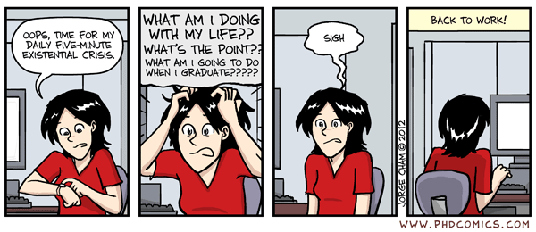

Awesome CS-Ja PhD Life
---

博士課程をサバイブするために参考になりそう/モチベになりそうな記事や資料のリスト。
日本語で読めるCS関連のものが中心です。
卒修論に役立つものも掲載しますし、その後のキャリアの話も掲載します。

## 前置き

- __趣味運営です。__ 誰かの役に立てばそれで良い。[方針](./CONTRIBUTION.md) も参照してください
- 私の/あの子のawesomeな記事が載ってない! => __プルリク等大歓迎です!__ (devからブランチ切ってください)
- 私の記事はawesomeじゃない => __博士課程/博士持ちってだけで既にawesomeですよ!__

<!-- START doctoc generated TOC please keep comment here to allow auto update -->
<!-- DON'T EDIT THIS SECTION, INSTEAD RE-RUN doctoc TO UPDATE -->
**Table of Contents**

- [心構え 👀](#%E5%BF%83%E6%A7%8B%E3%81%88-)
- [研究の進め方 ☕](#%E7%A0%94%E7%A9%B6%E3%81%AE%E9%80%B2%E3%82%81%E6%96%B9-)
  - [研究技術詳細 🔍](#%E7%A0%94%E7%A9%B6%E6%8A%80%E8%A1%93%E8%A9%B3%E7%B4%B0-)
  - [研究室の選び方](#%E7%A0%94%E7%A9%B6%E5%AE%A4%E3%81%AE%E9%81%B8%E3%81%B3%E6%96%B9)
  - [研究テーマの見つけ方](#%E7%A0%94%E7%A9%B6%E3%83%86%E3%83%BC%E3%83%9E%E3%81%AE%E8%A6%8B%E3%81%A4%E3%81%91%E6%96%B9)
  - [論文 📖](#%E8%AB%96%E6%96%87-)
    - [読み方 / 探し方](#%E8%AA%AD%E3%81%BF%E6%96%B9--%E6%8E%A2%E3%81%97%E6%96%B9)
    - [書き方 ✍️](#%E6%9B%B8%E3%81%8D%E6%96%B9-)
    - [卒修論](#%E5%8D%92%E4%BF%AE%E8%AB%96)
    - [その他tips](#%E3%81%9D%E3%81%AE%E4%BB%96tips)
  - [発表 💁](#%E7%99%BA%E8%A1%A8-)
    - [口頭発表](#%E5%8F%A3%E9%A0%AD%E7%99%BA%E8%A1%A8)
    - [ポスター発表](#%E3%83%9D%E3%82%B9%E3%82%BF%E3%83%BC%E7%99%BA%E8%A1%A8)
  - [英語との付き合い方](#%E8%8B%B1%E8%AA%9E%E3%81%A8%E3%81%AE%E4%BB%98%E3%81%8D%E5%90%88%E3%81%84%E6%96%B9)
  - [コーディング ⌨️](#%E3%82%B3%E3%83%BC%E3%83%87%E3%82%A3%E3%83%B3%E3%82%B0-)
  - [データ解析 📊](#%E3%83%87%E3%83%BC%E3%82%BF%E8%A7%A3%E6%9E%90-)
  - [広報・プロモーション 📢](#%E5%BA%83%E5%A0%B1%E3%83%BB%E3%83%97%E3%83%AD%E3%83%A2%E3%83%BC%E3%82%B7%E3%83%A7%E3%83%B3-)
- [研究ツール ⛏️](#%E7%A0%94%E7%A9%B6%E3%83%84%E3%83%BC%E3%83%AB-)
  - [全般](#%E5%85%A8%E8%88%AC)
  - [文献管理](#%E6%96%87%E7%8C%AE%E7%AE%A1%E7%90%86)
- [競争的資金・Fellowship 💰](#%E7%AB%B6%E4%BA%89%E7%9A%84%E8%B3%87%E9%87%91%E3%83%BBfellowship-)
  - [学振DC](#%E5%AD%A6%E6%8C%AFdc)
  - [その他](#%E3%81%9D%E3%81%AE%E4%BB%96)
- [査読 📚](#%E6%9F%BB%E8%AA%AD-)
  - [裏側](#%E8%A3%8F%E5%81%B4)
- [ネットワーキング🤝🏿](#%E3%83%8D%E3%83%83%E3%83%88%E3%83%AF%E3%83%BC%E3%82%AD%E3%83%B3%E3%82%B0)
- [コミュニティ運営 🙇](#%E3%82%B3%E3%83%9F%E3%83%A5%E3%83%8B%E3%83%86%E3%82%A3%E9%81%8B%E5%96%B6-)
- [博士課程に進むべきか 🚀](#%E5%8D%9A%E5%A3%AB%E8%AA%B2%E7%A8%8B%E3%81%AB%E9%80%B2%E3%82%80%E3%81%B9%E3%81%8D%E3%81%8B-)
- [海外PhDを目指す 🌎](#%E6%B5%B7%E5%A4%96phd%E3%82%92%E7%9B%AE%E6%8C%87%E3%81%99-)
- [就職活動・キャリア 🏄](#%E5%B0%B1%E8%81%B7%E6%B4%BB%E5%8B%95%E3%83%BB%E3%82%AD%E3%83%A3%E3%83%AA%E3%82%A2-)
- [研究生活記 😊 / aka. 怪文書](#%E7%A0%94%E7%A9%B6%E7%94%9F%E6%B4%BB%E8%A8%98---aka-%E6%80%AA%E6%96%87%E6%9B%B8)
  - [博士課程を振返って](#%E5%8D%9A%E5%A3%AB%E8%AA%B2%E7%A8%8B%E3%82%92%E6%8C%AF%E8%BF%94%E3%81%A3%E3%81%A6)
  - [社会人学生](#%E7%A4%BE%E4%BC%9A%E4%BA%BA%E5%AD%A6%E7%94%9F)
  - [海外留学](#%E6%B5%B7%E5%A4%96%E7%95%99%E5%AD%A6)
  - [長期インターンシップ](#%E9%95%B7%E6%9C%9F%E3%82%A4%E3%83%B3%E3%82%BF%E3%83%BC%E3%83%B3%E3%82%B7%E3%83%83%E3%83%97)
  - [学会](#%E5%AD%A6%E4%BC%9A)
  - [サマースクール](#%E3%82%B5%E3%83%9E%E3%83%BC%E3%82%B9%E3%82%AF%E3%83%BC%E3%83%AB)
  - [過程](#%E9%81%8E%E7%A8%8B)
  - [ポスドク編](#%E3%83%9D%E3%82%B9%E3%83%89%E3%82%AF%E7%B7%A8)
  - [助教・研究員編](#%E5%8A%A9%E6%95%99%E3%83%BB%E7%A0%94%E7%A9%B6%E5%93%A1%E7%B7%A8)
- [参考資料](#%E5%8F%82%E8%80%83%E8%B3%87%E6%96%99)
  - [英語](#%E8%8B%B1%E8%AA%9E)
  - [日本語](#%E6%97%A5%E6%9C%AC%E8%AA%9E)

<!-- END doctoc generated TOC please keep comment here to allow auto update -->

---

## 心構え 👀

- [研究をはじめる前に知っておいて欲しい7つのこと](https://speakerdeck.com/kaityo256/welcome-to-lab) [2021, [@kaityo256](https://twitter.com/kaityo256)]
- [博士の話](https://gist.github.com/kaityo256/bd73365ec4f756dc305b6f612343d27a) [2020, [@kaityo256](https://twitter.com/kaityo256)]
- [ロボット対話知能研究室へようこそ](http://pomdp.net/docs/20220427_intro_public_koichiro.slides.pdf) [2022, [@caesar\_wanya](https://twitter.com/caesar_wanya/status/1518877284408602624)]
- [大学院・研究者を目指す人へ](http://www7b.biglobe.ne.jp/~masaoamano/~masaoamano/da-xue-yuan-yan-jiu-zhewo-mu-zhisu-renhe.html) [[長崎大学水産学部海棲哺乳類研究室](http://www7b.biglobe.ne.jp/~masaoamano/)]
- [コンピュータ科学の博士課程にきて初めて分かったこと4つ](https://blog.junkato.jp/ja/posts/2012-11-13-cs-phd-findings/) [2012, [@arcatdmz](https://twitter.com/arcatdmz)]
- [研究者にとっての論文十ヶ条](http://scienceandtechnology.jp/archives/36348) [2020, http://scienceandtechnology.jp/]
- [学際研究と壁](https://mercurial-caper-b6a.notion.site/f4d3b5d6554841869d7f67dafc6dbae5) [2021, [@resnant](https://twitter.com/resnant)]
- [自分を知る，遊び場を作る](https://speakerdeck.com/eumesy/know-yourself-create-a-playground) [2023, [@sho\_yokoi\_](https://twitter.com/sho_yokoi_)]
- [この先生きのこるには](https://speakerdeck.com/verypluming/konoxian-sheng-kinokoruniha) [2024, [@verypluming](https://x.com/verypluming)]
- [研究とは何か](https://www.graco.c.u-tokyo.ac.jp/labs/morihata/research_memo.htm) [2023, [Akimasa Morihata](https://www.graco.c.u-tokyo.ac.jp/labs/morihata/)]
- [博士課程をゴリ押しする怪文書](https://note.com/66mh/n/ne5b679ceb630) [2024, [@66mh](https://x.com/66mh)]
- [博士課程の失敗記を30個集めて、教訓を抽出した](https://note.com/h_in_lab/n/n0dbf93f7e901) [2025, [@h\_in\_lab](https://note.com/h_in_lab)]
- [それでも私が研究を続ける理由](https://www.slideshare.net/slideshow/ss-244719834/244719834) [2021, [谷中瞳](https://x.com/verypluming)]

## 研究の進め方 ☕

- [研究をはじめてから国際会議と学術論文に採択されるまで](https://speakerdeck.com/kyama0321/yan-jiu-wohazimetekaraguo-ji-hui-yi-toxue-shu-lun-wen-nicai-ze-sarerumade-webgong-kai-ban) [2019, [Katsuhiko Yamamoto](https://sites.google.com/site/kyama0321/ja)]
- [一流論文誌・国際会議に採択されるための研究「心・技・体」](https://www.ipsj.or.jp/journal/info/hara75.pdf) [2014, [Takahiro Hara](https://mmde-lab.github.io/hara-webpage/)]
- [機械学習の研究者を目指す人へ](https://takahashihiroshi.github.io/contents/for_ml_beginners.html) [[Hiroshi Takahashi](https://takahashihiroshi.github.io/)]
- [矢谷流研究アイデアチェックリスト / Research Reality Check](https://iis-lab.org/misc/realitycheck/) [[@kojiyatani](https://twitter.com/kojiyatani)]
- [自己紹介とメタ視点の研究効率化Tips（研究生活のデザイン）について](https://snowman-88888.hatenablog.com/entry/2022/12/02/153435) [2022, [@sei\_shinagawa_](https://twitter.com/sei_shinagawa)]
- [研究における評価実験で重要な7つのこと](https://qiita.com/yu4u/items/606e6e5225ad9b603269) [2017, [@yu4u](https://twitter.com/yu4u)]
- [研究のまとめかた コントリビューションの見つけ方](https://www.dropbox.com/s/y983cazi4vjccaq/kickoff_research.pdf?dl=0) [2022, [@takurodadada](https://twitter.com/takurodadada)]
- [難関国際会議の壁](https://kanojikajino.github.io/2021-12-01/wall/) [2021, [@azaazarashi](https://twitter.com/azaazarashi)]
- [先行研究被りの話](https://kanojikajino.github.io/2022-02-13/prior-work/) [2022, [@azaazarashi](https://twitter.com/azaazarashi)]
- [研究はうまくいかない？- 困難な研究をゴールに繋げる秘訣とは](https://hondana-storage.s3.amazonaws.com/1040/files/12545_maegaki_mokuji.pdf) [2022, [@RYonetani](https://twitter.com/RYonetani)]
- [研究で詰まっている時におススメな本](https://snowman-88888.hatenablog.com/entry/2021/08/29/161357) [2021, [@sei_shinagawa](https://twitter.com/sei_shinagawa)]
- [君たちはどう研究するか](https://joisino.hatenablog.com/entry/2023/10/29/164650) [2023, [@joisino\_](https://twitter.com/joisino_)]
- [2024年度 研究の進め方](https://speakerdeck.com/hkefka385/20240410-yan-jiu-nojin-mefang) [2024, [@hkefka385](https://x.com/hkefka385)]
- [研究の進め方 ランダムネスとの付き合い方について](https://speakerdeck.com/joisino/randomness) [2024, [@joisino\_](https://x.com/joisino_)]
- [国際論文を出そう！ICRA / IROS / RA-L への論文投稿の心構えとノウハウ / RSJ2025 Luncheon Seminar](https://speakerdeck.com/koide3/rsj2025-luncheon-seminar) [2025, [@k\_koide3](https://x.com/k_koide3)]

### 研究技術詳細 🔍

- [情報系研究者のためのtips 2019年度版](https://qiita.com/guicho271828/items/3664aec81f6cc7e8f179) [2019, [@guicho271828](https://twitter.com/guicho271828)]
- [試行回数の増やし方 2021年度版](https://speakerdeck.com/butsugiri/increasing-number-of-attempts-ver-2021) [2021, [Shun Kinyono](https://butsugiri.github.io/)]
- [cvpaper.challenge 研究効率化 Tips](https://www.slideshare.net/cvpaperchallenge/cvpaperchallenge-tips-241914101) [2021, [cvpaper.challenge](https://twitter.com/CVpaperChalleng)]
- [Non-Research Tips for Information Science Researchers / 情報科学研究補助技法](https://non-research-tips.github.io/)

### 研究室の選び方

- [自分に合った研究室を選ぶために](https://note.com/drinami/n/nccf6c3160955) [2019, [@drinami](https://twitter.com/drinami)]

### 研究テーマの見つけ方

- [「研究テーマ」の正体](https://note.com/hisashi_is/n/ne5a7cae4854d) [2022, [@hisashi\_is](https://twitter.com/hisashi_is)]

### 論文 📖

#### 読み方 / 探し方

- [論文読みの日課について](https://joisino.hatenablog.com/entry/2023/04/10/170519) [2023, [@joisino\_](https://twitter.com/joisino_)]
- [論文の読み方](https://speakerdeck.com/kaityo256/how-to-survey) [2021, [@kaityo256](https://twitter.com/kaityo256)]
- [研究分野をサーベイする](https://www.slideshare.net/iTooooooooooooT/itolab-how-to-survey-2017) [2017, [@1T0T](https://twitter.com/1T0T)]
- [高速で論文がバリバリ読める落合先生のフォーマットがいい感じだったのでメモ](https://lafrenze.hatenablog.com/entry/2015/08/04/120205) [2015, [@aliliput](https://lafrenze.hatenablog.com/about)]
- [個人的Surveyのやり方](https://mocobt.hatenablog.com/entry/2020/05/13/021133) [2020, [@mocobt](https://twitter.com/mocobt)]
- [矢谷流論文の読み方](https://iis-lab.org/misc/paperreading/) [[Koji Yatani](https://iis-lab.org/member/koji-yatani/)]
- [論文輪読会 第1回 AI論文読み方講座](https://speakerdeck.com/academix/lun-wen-lun-du-hui-di-1hui-ailun-wen-du-mifang-jiang-zuo) [2023, [@shien5963](https://twitter.com/shien5963?ref_src=twsrc%5Egoogle%7Ctwcamp%5Eserp%7Ctwgr%5Eauthor)]
- [新入生向けチュートリアル：文献のサーベイv2](https://speakerdeck.com/a1da4/xin-ru-sheng-xiang-ketiyutoriaru-wen-xian-nosabeiv2) [2025, [@a1da\_](https://x.com/a1da_)]
- [サーベイ入門2025｜苗村研勉強会2025](https://www.docswell.com/s/yuchi/ZJ4VX1-2025-04-20-survey) [2025, [@yuchi\_yahagi](https://x.com/yuchi_yahagi)]

#### 書き方 ✍️

- [松尾組の論文の書き方](http://ymatsuo.com/japanese/ronbun_jpn.html) [2005, [@ymatsuo](https://twitter.com/ymatsuo)]
- [松尾組の論文の書き方：英語論文](http://ymatsuo.com/japanese/ronbun_eng.html) [2006, [@ymatsuo](https://twitter.com/ymatsuo)]
- [機械学習、NLP論文の書き方（英語）](https://zenn.dev/kotoba_tech/articles/e4f0b6203fe869) [2023, [@jungokasai](https://twitter.com/jungokasai)]
- [論文必勝法 ～基礎から一流誌・会議採録まで～ 講演スライド](https://www.ipsj.or.jp/journal/info/75NC.html) [2014, IPSJ]
- [国際会議論文の読み方・書き方](http://phontron.com/slides/neubig15nlptutorial.pdf) [2015, [Graham Neubig](http://www.phontron.com/index.php?lang=ja)]
- [論文執筆のためのチェックリスト](http://kanamori.cs.tsukuba.ac.jp/docs/writing_paper_checklist.pdf) [2020, [Yoshihiro Kanamori](http://kanamori.cs.tsukuba.ac.jp/index-ja.html)]
- [よい論文の書き方](https://rkmt.hatenadiary.org/entry/20101215/1292374172) [2010, [@rkmt](https://twitter.com/rkmt)]
- [CMU教授直伝の論文の書き方](https://yamaguchiyuto.hatenablog.com/entry/2016/01/18/154613) [2016, [@yamaguchiyuto](https://twitter.com/yamaguchiyuto)]
- [AI系トップカンファレンスへの論文採択に向けた試験対策](https://www.ai-gakkai.or.jp/jsai2020/wp-content/uploads/sites/10/2020/06/jsai2020_tutorial_suzuki_ver2.pdf) [2020, [Jun Suzuki](http://www.fai.cds.tohoku.ac.jp/members/js/index.html)]
- [論文を書く上での規則](https://qiita.com/Ishotihadus/items/d6088aec3632545833e8) [2021,  [@Ishotihadus](https://twitter.com/Ishotihadus)]
- [先生の「まずは論文の骨子を箇条書きで書いてみて」に対応する: 論文執筆の第一歩](https://shunk031.hatenablog.com/entry/lets-write-outline) [2021, [@shunk031](https://twitter.com/shunk031)]
- [論文の書き方](https://joisino.hatenablog.com/entry/2022/09/20/172453) [2022, [@joisino\_](https://twitter.com/joisino_)]
- [60 Questions & Answers公開版23](https://docs.google.com/document/d/180tNamxQFV2fWUOmEdtTFVy-R-sTgiFlbxL-o3Lg6n4/edit) [2023, [@keio\_smilab](https://twitter.com/keio_smilab)]

#### 卒修論

- [卒論の書き方](https://speakerdeck.com/kaityo256/happy-writing) [2020, [@kaityo256](https://twitter.com/kaityo256)]
- [修論(D論)参考](https://rkmt.hatenadiary.org/entry/20101217/1292573279) [2010, [@rkmt](https://twitter.com/rkmt)]
- [卒論・修論チェックリスト](https://qiita.com/tttamaki/items/f553e4cb9f4f08cc8872) [2017, [@ttttamaki](https://twitter.com/ttttamaki)]

#### その他tips

- [工学系の卒論生のための数式記述入門](https://github.com/mti-lab/math_writing) [2023, [@utokyo\_bunny](https://twitter.com/utokyo_bunny)]
- [論文執筆用 BiBTeX エントリ](https://github.com/tamaki-lab/lab-bibtex) [2023, [@ttttamaki](https://twitter.com/ttttamaki)]

### 発表 💁

- [研究発表を準備する（2022年版）](https://www.slideshare.net/iTooooooooooooT/2022-250960325) [2022, [@1T0T](https://twitter.com/1T0T)]
- [はじめての国際学会発表](https://rkmt.hatenadiary.org/entry/20100722/1279773843) [2010, [@rkmt](https://twitter.com/rkmt)]
- [研究発表でのよくある質問集](http://kanamori.cs.tsukuba.ac.jp/docs/presentation_faqs.html) [2017, [Yoshihiro Kanamori](http://kanamori.cs.tsukuba.ac.jp/index-ja.html)]
- [修論発表チェックリスト](https://rkmt.hatenadiary.org/entry/20100206/1265420441) [2010, [@rkmt](https://twitter.com/rkmt)]
- [はじめてのしつぎおうとう](https://speakerdeck.com/ssryuki/be-happy-together) [2020, [@ssr-yuki](https://github.com/ssr-yuki)]

#### 口頭発表

- [研究発表のためのプレゼンテーション技術](https://www.slideshare.net/ShinnosukeTakamichi/ss-48987441) [2015, [@forthshinji](https://twitter.com/forthshinji)]
- [イショティハドゥス的スライドの作り方](https://qiita.com/Ishotihadus/items/01a76cd3f7afebcb65b1) [2021, [@Ishotihadus](https://twitter.com/Ishotihadus)]
- [プレゼンテーションに悩むすべての人達のために：プレゼンテーションの世界標準「構造的プレゼンテーション」](https://kzhk.hatenadiary.org/entry/20091215/p2) [2009, [@kzhk](https://profile.hatena.ne.jp/kzhk/)]
- [見やすいプレゼン資料の作り方 - リニューアル増量版](https://www.slideshare.net/yutamorishige50/ss-41321443) [2014, [@morishigeyuta](https://twitter.com/morishigeyuta)]
- [プレゼンスライドがみるみる良くなる基本の推敲技術 -事例付き解説-](https://note.com/hisashi_is/n/n188b42f83dda) [2022, [@hisashi\_is](https://twitter.com/hisashi_is)]
- [わかりやすい説明のための 10 の鉄則](https://speakerdeck.com/e869120/wakariyasuisetsumei-10-tessoku) [2023, [@e869120](https://twitter.com/e869120)]
- [(英語での)良い研究発表とは](https://note.com/hciphds/n/nac86e8a74307) [2023, [@rikky0611](https://twitter.com/rikky0611)]
- [プレゼン資料作成で最低限気をつけるべきこと](https://speakerdeck.com/sgnm/purezendezui-di-xian-qi-wotukerubekikoto-suraidozuo-cheng) [2022, [@wkpeco](https://x.com/wkpeco)]

#### ポスター発表

- [ポスター発表と私](https://note.com/yamatchy/n/n1047b3b076a4) [2023, [@yamatchy](https://twitter.com/yamatchy)]

### 英語との付き合い方

404

### コーディング ⌨️
- [研究者流コーディングの極意](http://www.chokkan.org/publication/coding-for-researchers.pdf) [2013, [@chokkanorg](https://twitter.com/chokkanorg)]
- [忙しい研究者のためのテストコードとドキュメントの書き方](https://qiita.com/hmkz/items/0689cd85fb3e1adcda1a) [2018, [@hmkz_](https://twitter.com/hmkz_)]
- [研究のためのPython開発環境](https://zenn.dev/zenizeni/books/a64578f98450c2) [2022, [@ZeniYuki0922](https://twitter.com/zeniyuki0922)]

### データ解析 📊

- [探索的データ解析における正しい可視化手法の選び方と描き方](https://qiita.com/hanon52_/items/33488ed4fc4ece7e1aec) [2018, [@hanon52\_](https://twitter.com/hanon52_)]

### 広報・プロモーション 📢

- [自分の研究を自腹で広告した体験談](https://joisino.hatenablog.com/entry/2022/04/26/170707) [2022, [@joisino\_](https://twitter.com/joisino_)]

## 研究ツール ⛏️

### 全般

- [研究に便利なツールまとめ2021](https://note.com/moskomule/n/nb269e9d61631) [2021, [@mosko_mule](https://twitter.com/mosko_mule)]
- [汎用研究ツール群](https://kei18.github.io/note/posts/20220101_research-tools/) [2021, [@\_kei18](https://twitter.com/_kei18)]
- [研究系で使ってるツール](https://nzw0301.github.io/2018/03/tools) [2018, [@nzw0301](https://twitter.com/nzw0301)]
- [The Missing Semester of Your CS Education (日本語版)](https://missing-semester-jp.github.io/)

### 文献管理

- [私の研究おすすめツール（文献管理編）](https://note.com/takeshi_teshima/n/nd28a6e3dfb05) [2021, [@DiadochosT](https://twitter.com/DiadochosT)]

## 競争的資金・Fellowship 💰

- [Doctoral Students Funding Calendar](https://kn1cht.github.io/doctor-funding-calendar/) [2022, [@kn1cht](https://github.com/kn1cht)]
- [【2023最新まとめ】博士課程への奨学金・経済的支援](https://www.academianote.site/scholarship/) [2023, [@HAcademianote](https://twitter.com/HAcademianote)]

### 学振DC
- [学振特別研究員になるために～2023年度申請版](https://www.slideshare.net/tonets/gakushin23) [2022, [@tonets](https://twitter.com/tonets)]
- [DC1の話](https://nzw0301.github.io/2017/12/DC1) [2018, [@nzw0301](https://twitter.com/nzw0301)]
- [学振取るまで（NAIST 版）](https://cl.sd.tmu.ac.jp/~komachi/docs/jsps.html) [[@mamoruk](https://twitter.com/mamoruk)]
- [学振特別研究員に向けて – 体験談 – (2020年度DC-1採用内定)](http://www.ritsumei.ac.jp/file.jsp?id=454417) [2020, [Hiroki Nishikawa](https://sites.google.com/view/nishikawahiroki/home-japanese)]
- [私の学振DC2体験談 (2021~2022年度 学振 DC2 採用)](https://speakerdeck.com/shunk031/jsps-dc-hosei-seminar-2023) [2022, [@shunk031](https://twitter.com/shunk031)]

### その他

- [研究提案書の書き方](https://mosko.tokyo/ja/blog/how_to_write_research_proposals/) [2021, [@mosko_mule](https://twitter.com/mosko_mule)]
- [日本からでも応募できる情報科学系Fellowship](https://blog.junkato.jp/ja/posts/2015-09-26-is-cs-fellowship-application-from-japan/) [2015, [@arcatdmz](https://twitter.com/arcatdmz)]
- [Microsoft Research Asia Ph.D. Fellowship 2019 体験談](https://inaguma0810.hatenablog.com/entry/2020/06/18/193438) [2018, [@HirofumiInaguma](https://twitter.com/HirofumiInaguma)]
- [Microsoft Research Asia Fellowship応募のすすめ](https://blog.junkato.jp/ja/posts/2014-05-16-microsoft-research-asia-fellowship/) [2014, [@arcatdmz](https://twitter.com/arcatdmz)]
- [あらためて、ACT-Xをご紹介します](https://note.com/jst_kisokenkyu/n/n51bb34b3dc93) [2021, [@JST_Kisokenkyu](https://twitter.com/JST_Kisokenkyu)]
- [京都大学白眉プロジェクトに採択されるまで](https://hermite.jp/post/2021/hakubi/) [2021, [Han Bao](https://hermite.jp/)]
- [博士課程の金策](https://kasegao.github.io/posts/2023/03/money/) [2023, [@Kasega0](https://twitter.com/Kasega0)]

## 査読 📚

- [査読の仕方](https://gist.github.com/kaityo256/5654eceac4f831f9bc2c2c8069baac00) [2021, [@kaityo256](https://twitter.com/kaityo256)]
- [査読報告書の書き方, 条件付き採録となったときの回答文の書き方](https://www.ieice.org/~cs-edit/magazine/hp/kakikata/kaitou.pdf) [2009, [Takuya Asaka](https://www.comp.sd.tmu.ac.jp/asaka-lab/HomePage/index.html)]

### 裏側
- [OS系トップ会議の査読プロセス](https://note.com/michioh/n/nd2608d3483fe) [2019, [@michioh](https://twitter.com/michioh)]
- [国際会議プログラム委員のお仕事](https://blog.junkato.jp/ja/posts/2019-08-16-roles-of-academic-conf-pc-members/) [2019, [@arcatdmz](https://twitter.com/arcatdmz)]
- [国際会議運営記](https://www.slideshare.net/iTooooooooooooT/ss-95092188/) [2018, [@1T0T](https://twitter.com/1T0T)]

## ネットワーキング🤝🏿

- [学会の真の本番とも言われる懇親会で新しい知り合いをつくるコツについて](https://snowman-88888.hatenablog.com/entry/2022/03/20/031728) [2022, [@sei_shinagawa](https://twitter.com/sei_shinagawa)]

## コミュニティ運営 🙇

- [「我々の間にはチームプレーなどという都合のよい言い訳は存在せん．あるとすればスタンドプレーから生じるチームワークだけだ」](https://www.keyakkie.com/%E8%A8%98%E4%BA%8B/%E6%97%A7%E3%82%B5%E3%82%A4%E3%83%88%E8%A8%98%E4%BA%8B%E6%88%91%E3%80%85%E3%81%AE%E9%96%93%E3%81%AB%E3%81%AF%E3%83%81%E3%83%BC%E3%83%A0%E3%83%97%E3%83%AC%E3%83%BC%E3%81%AA%E3%81%A9%E3%81%A8%E3%81%84%E3%81%86%E9%83%BD%E5%90%88%E3%81%AE%E3%82%88%E3%81%84%E8%A8%80%E3%81%84%E8%A8%B3%E3%81%AF%E5%AD%98%E5%9C%A8%E3%81%9B%E3%82%93%E3%81%82%E3%82%8B%E3%81%A8%E3%81%99%E3%82%8C%E3%81%B0%E3%82%B9%E3%82%BF%E3%83%B3%E3%83%89%E3%83%97%E3%83%AC%E3%83%BC%E3%81%8B%E3%82%89%E7%94%9F%E3%81%98%E3%82%8B%E3%83%81%E3%83%BC%E3%83%A0%E3%83%AF%E3%83%BC%E3%82%AF%E3%81%A0%E3%81%91%E3%81%A0) [[@keyakkie](https://twitter.com/keyakkie)]

## 博士課程に進むべきか 🚀

- [博士課程について](https://drive.google.com/file/d/1M-0SkN9AtSa6xlbETiALKUKFBzkG1nc4/view) [2023, [@66mh](https://twitter.com/66mh)]
- [大学院進学が切り拓く情報系学生のキャリア](https://www.slideshare.net/iTooooooooooooT/ss-249643136) [2021, [@1T0T](https://twitter.com/1T0T)]
- [mast随一の意識低い系が博士課程に進んじゃった話](https://note.com/yamatchy/n/naa4214b2fbf5) [2021, [@yamatchy](https://twitter.com/yamatchy)]
- [博士課程に進むときに考えたと思われること、今思うこと](https://nzw0301.github.io/2018/12/d) [2018, [@nzw0301](https://twitter.com/nzw0301)]
- [ソフトウェアエンジニアとして就職する時に考えたこと](https://shopetan.hatenablog.com/entry/2018/12/21/000813) [2018, [@ss_shopetan](https://twitter.com/ss_shopetan)]
- [博士課程に進むときに考えたこと](https://blog.makky.io/articles/2018/12/18/d/) [2018, [Masaki Kobayashi](https://www.makky.io/)]
- [博士後期課程に行くか延々悩んだ結果やめた](https://kuri8ive.hatenablog.com/entry/why-i-didnt-go-to-phd) [2022, [@kuri8ive](https://twitter.com/kuri8ive)]
- [高専から大学編入をして修士に進学し博士に進学した理由](https://elnikkis.hatenablog.jp/entry/2018/12/22/185218) [2018, [@elnikkis](https://elnikkis.hatenablog.jp/about)]

## 海外PhDを目指す 🌎

- [アメリカでCS博士課程に合格するための戦略について考える](https://sff8.hatenablog.com/entry/2022/02/07/121021) [2022, [@s1wase](https://twitter.com/s1wase)]
- [米国大学院PhD出願に対する私なりの臨み方](https://usaito.hatenablog.com/entry/2021/04/16/190131) [2021, [@usait0](https://twitter.com/usait0)]
- [アラサー社会人、退職してアメリカ情報系大学院PhDを目指す](https://note.com/micke/n/nbf8686b9a46b) [2020, [@ochngn](https://twitter.com/ochugn)]
- [アメリカ博士課程留学 − 立志編](https://travelingresearcher.com/entry/2020/02/13/164943) [2020, [@00\_](https://twitter.com/00_)]
- [CanadaでのComputer ScienceのPhD進学に向けて](https://speakerdeck.com/hiroki11x/towards-cs-phd-in-canada) [2020, [@_Hiroki11x](https://twitter.com/_Hiroki11x)]
- [日本の学部からアメリカのコンピューターサイエンス博士課程に出願する](https://akaria.hatenablog.com/entry/2019/08/22/185244) [2019, [@AkariAsai](https://twitter.com/AkariAsai)]
- [コンピュータサイエンスでPhDプログラムに留学したい方へのアドバイス](https://note.com/ryosuzuki/n/n60d53f04966c) [2020, [@HCI_Comics](https://twitter.com/HCI_Comics)]
- [留学の経緯と準備](https://drive.google.com/file/d/16O8eWYnsmzv-RXSN0vKZ17y96wZEvYs1/view) [2020, [@Yuki_Doradora](https://twitter.com/Yuki_Doradora)]
- [日本と北米のCS系博士課程の違い](https://yutanoma.hatenablog.com/entry/2024/06/08/132924) [2024, [@ytnm0520](https://x.com/ytnm0520)]
- [アメリカCS博士課程 前半2年間の記録（PhD Candidateになりました）](https://ryokamoi.blogspot.com/2025/05/cs-2phd-candidate.html) [2025, [@RyoKamoi](https://x.com/RyoKamoi)]

## 就職活動・キャリア 🏄

- [博士ならではの就職活動のやり方](https://qiita.com/nekonibox/items/005c339e071685edf5f6) [2020, [@nekonibox](https://qiita.com/nekonibox)]
- [研究者として海外就活した話](https://www.evernote.com/shard/s733/client/snv?noteGuid=5667b196-fc15-4cf9-b21b-3dc42557294f&noteKey=4a33db22438e5d8febac15ff538e0df6&sn=https%3A%2F%2Fwww.evernote.com%2Fshard%2Fs733%2Fsh%2F5667b196-fc15-4cf9-b21b-3dc42557294f%2F4a33db22438e5d8febac15ff538e0df6&title=%25E7%25A0%2594%25E7%25A9%25B6%25E8%2580%2585%25E3%2581%25A8%25E3%2581%2597%25E3%2581%25A6%25E6%25B5%25B7%25E5%25A4%2596%25E5%25B0%25B1%25E6%25B4%25BB%25E3%2581%2597%25E3%2581%259F%25E8%25A9%25B1) [2019]
- [エディンバラ大学の教員になるまで]() [2019, [@michioh](https://twitter.com/michioh)]
- [怪文書2022](https://nzw0301.github.io/2022/04/finding-job) [2022, [@nzw0301](https://twitter.com/nzw0301)]
- [３－４．博士課程大学院生・ポスドクさんへ](https://home.hiroshima-u.ac.jp/kawazoe/html/Supervision3-4.html) [2012, [Takaaki Kawazoe](https://home.hiroshima-u.ac.jp/kawazoe/index.html)]
- [日本の大学からアメリカのbig techでresearch scientistになるまで](https://note.com/hirofumi0810/n/nbe95832a12d7) [2023, [@HirofumiInaguma](https://twitter.com/HirofumiInaguma)]
- [東京大学を離れるにあたって](https://sites.google.com/site/shinnosuketakamichi/blog/%E6%9D%B1%E4%BA%AC%E5%A4%A7%E5%AD%A6%E3%82%92%E9%9B%A2%E3%82%8C%E3%82%8B%E3%81%AB%E3%81%82%E3%81%9F%E3%81%A3%E3%81%A6) [2024, [@forthshinji](https://x.com/forthshinji)]
- [情報理工学系の産業界とアカデミアは今後どうしたらいいの？](https://blog.junkato.jp/ja/posts/2014-07-19-japanese-ist-society-phd/) [2014, [@arcatdmz](https://twitter.com/arcatdmz)]
- [私のキャリアパス紹介 〜アカデミアから民間企業に転職して〜 (P10-)](https://cbi-society.org/home/documents/society_journal/CBI_2022_10_2.pdf) [2022, [Masaaki Kotera](https://researchmap.jp/maskot)]
- [筑波大学を退職します](https://note.com/takefumihiraki/n/nf036cd8a54a4) [2023, [@TakefumiHIRAKI](https://twitter.com/TakefumiHIRAKI)]

## 研究生活記 😊 / aka. 怪文書

### 博士課程を振返って

- [博士課程3年間を終えるにあたって](https://enp1s0.dev/phd.html) [2023, [@tensorcore](https://twitter.com/tensorcore)]
- [博士課程を振り返って](https://ssr-yuki.github.io/yukipedia/misc/feelings_in_doctoral_journey) [2025, [@ssr-yuki](https://github.com/ssr-yuki)]
- [CMUでの博士課程を振り返る](https://sff8.hatenablog.com/entry/2025/10/26/155806) [2025, [@s1wase](https://x.com/s1wase)]
- [博士課程で得られたもの・失ったもの](https://www.0x0c.me/2023/12/phd) [2023, [Akira MATSUDA](https://www.0x0c.me/)]
- [情報系博士課程修了までに経験したこと・感じたことに関する独り言](https://note.com/_mhirano/n/nc4c256993263) [2023, [@\_mhirano](https://twitter.com/_mhirano)]
- [凡人による社会人博士課程生存戦略](https://zenn.dev/hidetoshi/articles/20230401_doctoral-course-strategy) [2023, [@Hidetoshi\_RM](https://twitter.com/hidetoshi_rm)]
- [転職エントリー（東大の博士課程・理研JRA→(株)リクルートのデータサイエンティスト）](https://note.com/takeshi_teshima/n/n919b14bc3644#5eb80eba-e6da-4c0d-a015-658fb2527c1a) [2022, [@DiadochosT](https://twitter.com/DiadochosT)]
- [日本の博士課程 〜若手シンポジウム’21 カウントダウンカレンダー〜](https://sites.google.com/view/statsmlsymposium21/countdown_articles) [2021]
- [社会人博士しての博士課程を振り返り](https://lcstmarck.hatenablog.com/entry/2023/03/29/195534) [2023, [@lcst\_topevx](https://twitter.com/lcst_topevx)]
- [趣味のプログラミングで博士号を取った社会人の覚え書き](https://zenn.dev/canard0328/articles/memorandum-of-phd) [2022, [@canard0328](https://x.com/canard0328)]
- [京都大学博士（情報学）の学位を取得しました](https://rand.pepabo.com/article/2017/05/24/doctor-matsumotory/) [2017, [@matsumotory](https://twitter.com/matsumotory)]
- [過去の自分に見せたい博士課程のTips](https://note.com/momongaclub/n/nf366c05e46e2) [2025, [@tyariRAD](https://x.com/tyariRAD)]
- [博士課程あることないこと](https://kei18.github.io/note/posts/20230331_phd) [2023, [@\_kei18](https://twitter.com/_kei18)]

### 社会人学生

- [社会人学生に関するサイトまとめ](https://yumulog.hatenablog.com/entry/20120205/1328442737) [2020, [@yumu19](https://twitter.com/yumu19)]
- 社会人学生 Advent Calendar
  [[2025]](https://adventar.org/calendars/12272)
  [[2024]](https://adventar.org/calendars/10520)
  [[2023]](https://adventar.org/calendars/9433)
  [[2022]](https://adventar.org/calendars/7910)
  [[2021]](https://adventar.org/calendars/6250)
  [[2020]](https://adventar.org/calendars/5096)
  [[2019]](https://adventar.org/calendars/4496)
- [「社会人」大学院生であることを最大限活用するには？ー博士（情報科学）取得の報告にかえて](https://rand.pepabo.com/article/2025/03/24/antipop-doctor/) [2025, [@kentaro](https://x.com/kentaro)]

### 海外留学

- 研究留学 Advent Calendar
  [[2017]](https://adventar.org/calendars/2562)
  [[2019]](https://adventar.org/calendars/4026)
  [[2025]](https://adventar.org/calendars/12626)
- [訪問研究0週目](https://note.com/moskomule/n/n36b72d07bebb) [2021, [@mosko_mule](https://twitter.com/mosko_mule)]
- [フランスの地方都市に半年間留学した話（研究編・前編）](https://note.com/namicha/n/n47b864b87384) [2018, [@namicha_1](https://twitter.com/namicha_1)]
- [ミシガン大学に滞在して研究した話](https://hermite.jp/post/2022/statsml/) [2022, [Han Bao](https://hermite.jp/)]
- [UCL に滞在した話（行くまで編）](https://nzw0301.github.io/2019/08/ucl) [2019, [@nzw0301](https://twitter.com/nzw0301)]
- [パリ研究留学記](https://kei18.github.io/note/posts/20220927_paris/) [2022, [@\_kei18](https://twitter.com/_kei18)]
- [英国ケンブリッジ滞在記録](https://ssr-yuki.github.io/yukipedia/overseas/2023cam/) [2023, [@ssr-yuki](https://github.com/ssr-yuki)]
- [日本人の全くいない環境で研究してた話【韓国・KAIST研究滞在留学】](https://note.com/yamatchy/n/nfd7282c99c52) [2022, [@yamatchy](https://twitter.com/yamatchy)]
- [MBZUAI での Visiting Student](https://zenn.dev/tatsuro_pfgt/articles/14b949482b436f) [2024, [@Ina\_pfgt](https://x.com/Ina_pfgt)]

### 長期インターンシップ

- [Microsoft Research Internship アルムナイ Advent Calendar 2020](https://adventar.org/calendars/5107)
- [OMRON SINIC X (OSX) のインターン感想](https://syuntoku14.github.io/post/omron/) [2022, [@t_kitamura14](https://twitter.com/t_kitamura14)]
- [OMRON SINIC X (OSX) インターン記](https://kei18.github.io/note/posts/20211129_osx-intern/) [2021, [@\_kei18](https://twitter.com/_kei18)]

### 学会

- [NAACL2022 & *SEM2022現地参加報告とアメリカでCOVID-19に感染した話](https://blog.hpprc.dev/posts/naacl2022) [2022, [@hpp\_ricecake](https://twitter.com/hpp_ricecake)]
- [CIKM2022 参加報告](https://shunk031.hatenablog.com/entry/cikm2022) [2022, [@shunk031](https://twitter.com/shunk031)]
- [NeurIPS 2024 参加記](https://mti-lab.github.io/blog/2025/01/18/neurips2024.html) [2024, [@utokyo\_bunny](https://x.com/utokyo_bunny)]

### サマースクール

- [IEEE RAS Summer School on Multi Robot Systems 2023 参加記録](https://kazuho-koba.github.io/MRS-SummerSchool2023.html) [2023, [@Kazu\_KOBA](https://twitter.com/KazuhoKobayashi)]
- [ICAPS-20 Summer School on Automated Planning & Schedulingに参加してきました](https://kei18.github.io/note/posts/20201017_icaps-summer-school/) [2020, [@_kei18](https://twitter.com/_kei18)]

### 過程

- [cvpaper.challenge (Note)](https://note.com/cvpaperchallenge/)
- Human-Computer Interaction (HCI) Advent Calendar
  [[2021]](https://adventar.org/calendars/6523)
  [[2022]](https://adventar.org/calendars/7901)
  [[2023]](https://adventar.org/calendars/9287)
  [[2024]](https://adventar.org/calendars/10549)
  [[2025]](https://adventar.org/calendars/11477)
- [博士課程 Advent Calendar]
  [[2014]](https://adventar.org/calendars/548)
- [カーネギーメロン大学での1年目を振り返る](https://sff8.hatenablog.com/entry/2021/08/08/170310) [2021, [@s1wase](https://twitter.com/s1wase)]
- [CMU HCII 探検記](https://note.com/hciphds/n/na4798b37a0d2) [2021, [@rikky0611](https://twitter.com/rikky0611)]
- [博士課程2年の備忘録 (2021.2-2022.1)](https://kei18.github.io/note/posts/20220130_essay/) [2022, [@\_kei18](https://twitter.com/_kei18)]
- [小さな狂気の閃光を失うな](https://note.com/maguro274/n/n917716a3fbf8) [2022, [@maguroIsland](https://twitter.com/maguroIsland)]
- [NLP研究を始めてから主要国際会議に論文を通すまでの振り返り](https://yusuke196.hatenablog.com/entry/2025/04/13/001021) [2025, [@yusuke196](https://x.com/yusuke196)]
- [IT初心者だった私が、修士2年生でCVPR2025(Highlight)に通すまで](https://note.com/oguryu/n/n408b98657163) [2025, [@Oguryu417](https://x.com/Oguryu417)]

### ポスドク編

- [2年間スイス・ポスドクをやってみた](https://note.com/forest_opener/n/n3bf72df42671) [2023, [@hiraku\_mrt](https://twitter.com/hiraku_mrt)]
- [而立](https://hermite.jp/post/2025/thirty/) [2025, [@levelfour\_](https://x.com/levelfour_)]

### 助教・研究員編

- [助教0年目の振り返り](https://medium.com/@unilight/%E5%8A%A9%E6%95%990%E5%B9%B4%E7%9B%AE%E3%81%AE%E6%8C%AF%E3%82%8A%E8%BF%94%E3%82%8A-a6bc23dd6253) [2025, [@unilightwf](https://x.com/unilightwf)]
- [パーマネント研究職に 2 年就いてみて](https://note.com/ishotihadus/n/ne82c9e19daf2) [2025, [@Ishotihadus](https://x.com/Ishotihadus)]

## 参考資料

### 英語

- [Collection of advice for prospective and current PhD students](https://github.com/pliang279/awesome-phd-advice#other-similar-collections) [2022, [@pliang279](https://github.com/pliang279)]

### 日本語

- [研究の進め方（論文の読み方,書き方,プレゼンの仕方）まとめ](https://github.com/SeitaroShinagawa/FavoritePapers/blob/master/summary/how_to_make_progress.md) [2022, [@sei_shinagawa](https://twitter.com/sei_shinagawa)]
- [卒業研究をはじめる前に読んでおきたかったリンク集](https://qiita.com/tomoyk/items/26461073b5709ffe75d3) [2021, [@tmyk_kym](https://twitter.com/tmyk_kym)]
- [卒論・修論研究の攻略](https://note.com/hisashi_is/m/m00b5dd30d9bb)
- [情報系院生に向けた研究インターン体験記まとめ](https://maruruy.hatenablog.com/entry/20231020/1697793300) [2023, [@maruru0090)](https://x.com/maruru0090)]
